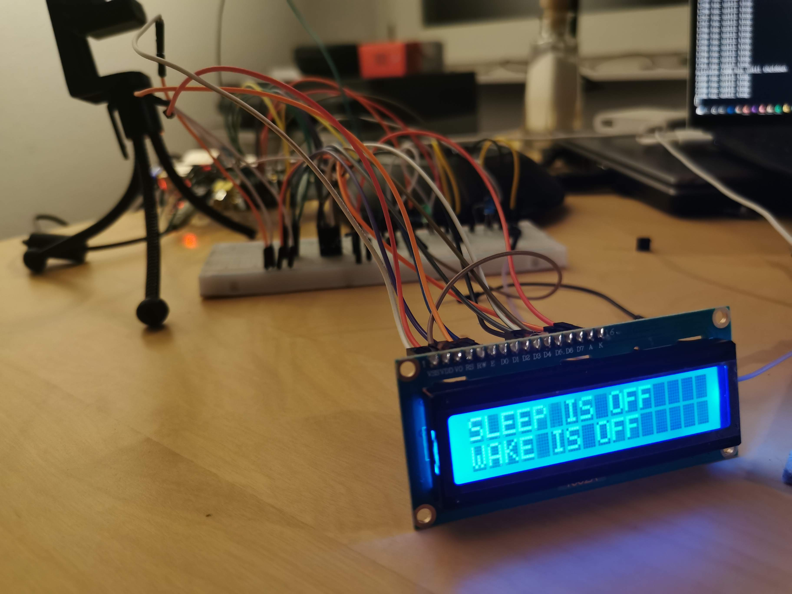

# Sleepy

Ein kleiner Sleep-Timer / Wecker Prototyp für den Raspberry PI um das Handy aus
dem Schlafzimmer zu halten, ohne die Vorteile des Einschlafens und Aufwachens
mit der eigenen Musik zu verlieren.

Prinzipien:
Der "Sleepy", soll nur 3 Buttons haben, mit denen sich die einzelnen Status
umschalten lassen. Sonst nicht viel Schnickschnack.
- Sleeptimer Start, Veränderng auf 20, 30, 40, Ende
- Wecker Starten, Stoppen, Beenden
- LEDs für den Status für die Zeit des Kopfdrucks aktivieren.

Einstellungen über eine App oder Eine Weboberfläche.

TODO
- fadeout
- fadein
- player-config
- web app
- tests
